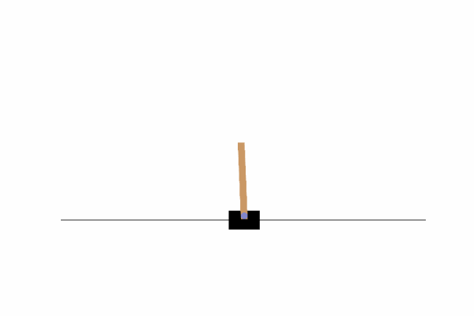
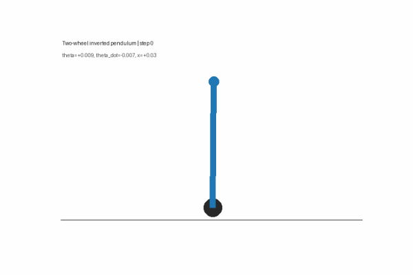
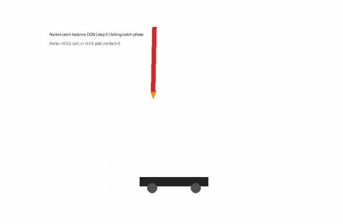
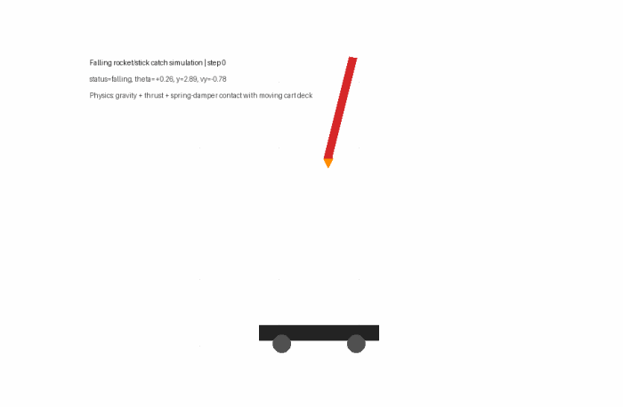

# DQN Reinforcement Learning Extensions

This repository contains a set of reinforcement-learning notebooks developed from a basic CartPole DQN practical session. The project starts with a filled baseline DQN, then extends it toward algorithm design comparisons, wheeled inverted-pendulum robots, MuJoCo reproductions, and a rocket/stick catch-balance DQN task.

## Visual Results

### CartPole DQN Algorithm Design



The best CartPole agent reached the 500-step cap on all 10 greedy evaluation seeds.

### Two-Wheel Self-Balancing Robot



A toy wheeled inverted-pendulum robot trained with DQN.

### Rocket / Falling Stick Catch-Balance DQN



The agent controls the cart, catches the falling stick, and keeps it balanced after contact.

### Physics Landing Demo



A separate hand-written physics/control demo with gravity and spring-damper contact.

## Notebooks

| Notebook | Purpose |
|---|---|
| `notebooks/rl_algorithm_design_comparison.ipynb` | Compare DQN algorithm-design choices on CartPole. |
| `notebooks/two_wheel_self_balancing_robot.ipynb` | Train a toy two-wheel self-balancing robot with DQN. |
| `notebooks/rocket_catch_balance_dqn.ipynb` | Train a DQN agent to catch a falling stick and balance it on a cart. |
| `notebooks/rocket_vertical_landing_catch_sim.ipynb` | Physics-only rocket/stick landing demo with spring-damper contact. |
| `notebooks/mujoco_inverted_pendulum_reproduction.ipynb` | Quick PPO reproduction on Gymnasium MuJoCo inverted-pendulum tasks. |

## 1. CartPole Algorithm Design Comparison

The notebook `rl_algorithm_design_comparison.ipynb` compares five DQN variants under the same environment and evaluation protocol.

| Agent | Main idea | Eval Mean | Eval Min | Eval Max |
|---|---|---:|---:|---:|
| Baseline DQN | Original reward, epsilon-greedy, standard DQN target | 98.8 | 96 | 102 |
| Reward Shaping DQN | Adds angle, position, and angular-velocity penalties | 500.0 | 500 | 500 |
| Double DQN | Separates action selection and target evaluation | 116.1 | 114 | 121 |
| Dueling Double DQN + Shaping | Adds value/advantage decomposition | 500.0 | 500 | 500 |
| Softmax Double DQN + Shaping | Uses Boltzmann/softmax exploration | 500.0 | 500 | 500 |

### Baseline DQN Target

The original DQN target is:

```math
y_{\text{DQN}}
= r + \gamma \max_{a'} Q_{\text{target}}(s', a')
```

The loss is:

```math
\mathcal{L}
= \text{Huber}\left(Q_{\text{policy}}(s,a) - y\right)
```

### Reward Shaping

The original CartPole reward is:

```math
r_t = 1
```

The shaped reward used in the comparison is:

```math
r'_t
= 1
- 0.45 \cdot \frac{|\theta|}{\theta_{\max}}
- 0.20 \cdot \frac{|x|}{x_{\max}}
- 0.01 \cdot |\dot{\theta}|
```

where:

- `x` is cart position
- `theta` is pole angle
- `theta_dot` is pole angular velocity
- `x_max = 2.4`
- `theta_max = 12 * pi / 180`

The key result was that reward shaping improved greedy evaluation from `98.8` to `500.0` steps.

### Double DQN

Double DQN changes the target from:

```math
y_{\text{DQN}}
= r + \gamma \max_{a'} Q_{\text{target}}(s',a')
```

to:

```math
a^*
= \arg\max_{a'} Q_{\text{policy}}(s',a')
```

```math
y_{\text{DoubleDQN}}
= r + \gamma Q_{\text{target}}(s',a^*)
```

This reduces Q-value overestimation by separating action selection from action evaluation.

### Dueling DQN

Dueling DQN decomposes Q-values into state value and action advantage:

```math
Q(s,a)
= V(s) + A(s,a)
- \frac{1}{|\mathcal{A}|}\sum_{a'} A(s,a')
```

In this project, dueling architecture solved the task when combined with reward shaping, but did not clearly outperform the simpler Reward Shaping DQN.

### Softmax Exploration

Softmax exploration samples actions using:

```math
P(a|s)
=
\frac{\exp(Q(s,a)/T)}
{\sum_{a'} \exp(Q(s,a')/T)}
```

where `T` is the temperature. It is less blindly random than epsilon-greedy, but can be sensitive to Q-value scale.

## 2. Two-Wheel Self-Balancing Robot

The notebook `two_wheel_self_balancing_robot.ipynb` implements a toy wheeled inverted-pendulum robot.

State:

```text
[body angle, angular velocity, wheel position, wheel velocity]
```

Actions:

```text
{-1, 0, +1} motor command
```

Final greedy evaluation:

```text
[400, 400, 400, 400, 400, 400, 384, 400, 400, 400]
Mean = 398.4
Min = 384
Max = 400
```

This connects CartPole to Segway-like two-wheel balancing robots.

## 3. Rocket / Falling Stick Catch-Balance DQN

The notebook `rocket_catch_balance_dqn.ipynb` reformulates the earlier rocket/stick landing demo as a real DQN task.

The agent controls only the cart:

```text
0 = cart left
1 = stay
2 = cart right
```

State:

```text
[
  rocket_x - cart_x,
  rocket_y,
  theta,
  vx - cart_v,
  vy,
  theta_dot,
  cart_x,
  cart_v,
  contact_flag,
  foot_x - cart_x
]
```

The task has two stages:

1. catch the falling stick
2. keep it balanced for as long as possible after contact

Final DQN result:

```text
Mean steps: 500.0
Contact success rate: 100%
Mean post-contact balance: 478.7 steps
```

Greedy rollout evaluation:

```text
Mean total steps: 497.2
Contact success rate: 100%
Mean post-contact balance time: 475.6 steps
Best rollout: 500 total steps, 479 post-contact steps
```

This is the closest extension to the original CartPole DQN idea: the score rewards long survival after the object lands on the cart.

## 4. Rocket Landing Physics Demo

The notebook `rocket_vertical_landing_catch_sim.ipynb` is not reinforcement learning. It is a hand-written physics/control demonstration with:

- gravity
- thrust
- side control
- angular stabilization
- moving landing platform
- spring-damper contact

The contact force is:

```math
F_{\text{contact}}
= k \cdot \text{penetration} - c \cdot v_{\text{normal}}
```

Final simulation result:

```text
caught / landed: 12 / 12 seeds
```

This notebook is included as a physics visualization baseline, while `rocket_catch_balance_dqn.ipynb` is the actual RL version.

## 5. MuJoCo Reproduction

The notebook `mujoco_inverted_pendulum_reproduction.ipynb` connects the project to continuous-control benchmarks.

Because MuJoCo uses continuous actions, PPO is used instead of DQN.

Observed results:

```text
InvertedPendulum-v5:
eval length mean = 949.2
10-seed greedy rollout = 500 / 500 for every seed

InvertedDoublePendulum-v5:
eval length mean = 93.0
best displayed rollout = 163 steps

Lee-2025-inspired transition task:
mean rollout length = 42.0
best rollout length = 80 steps
```

The single inverted pendulum is easy to reproduce quickly. The double-pendulum transition task is much harder and remains a partial reproduction.

## Main Takeaways

1. Reward design can matter more than algorithmic complexity.
2. Double DQN is theoretically useful for reducing overestimation, but it did not solve CartPole alone under this training budget.
3. Dueling and softmax variants solved the task when combined with reward shaping.
4. CartPole naturally extends to two-wheel self-balancing robots.
5. The rocket/stick catch-balance environment turns landing into a long-horizon RL survival problem.
6. MuJoCo continuous-control tasks require algorithms such as PPO/SAC/TD3 rather than discrete-action DQN.

## References

- Mnih et al. (2015), *Human-level control through deep reinforcement learning*.
- Van Hasselt et al. (2016), *Deep Reinforcement Learning with Double Q-learning*.
- Wang et al. (2016), *Dueling Network Architectures for Deep Reinforcement Learning*.
- Schaul et al. (2015), *Prioritized Experience Replay*.
- Kajita et al. (2001), *The 3D Linear Inverted Pendulum Model*.
- Lee et al. (2025), *Transition Control of a Double-Inverted Pendulum System Using Sim2Real Reinforcement Learning*.

